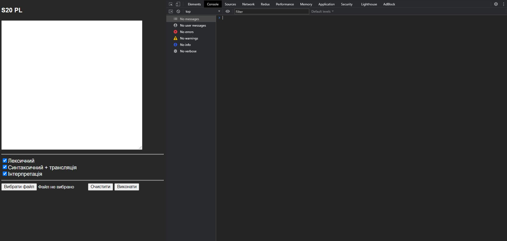
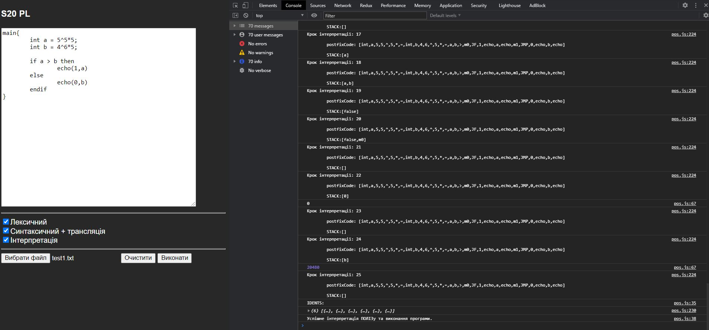
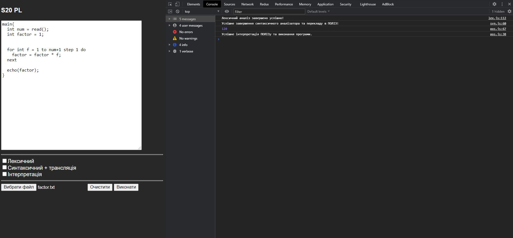

# S20 programming language

## Возможности

**Арифметика**: основные арифметические операции<br>
- сложение
- вычитание
- деления
- умножения 
- возведение в степень (правоасоциативна операция)
- скобки
- экспоненциальная форма действительного числа

**Инструкция повторения** <br>
*for <ид> = <выражение> to <выражение> step <выражение> do <список
операторов> next* 
<br>
**Инструкция условия**: <br>
*if <логическое выражение> then <список операторов> else
<Список операторов> endif*


## Принцип работы 
<br>
Программа, написанная на языке S20, подается на вход транслятора для трансформации
к целевой форме. Результат трансляции выполняется в системе времени выполнения
(Run-time system), для чего принимает входные данные и предоставляет результат выполнения
программы.
Трансляция предусматривает фазы лексического, синтаксического и семантического
анализа, а также фазу генерации кода. Фазы лексического и синтаксического
анализа осуществляются отдельными проходами.

## Использование
Открыть:
```javascript
index.html
```
 index.html<br><br> 
 Тест базового примера<br><br>
 Исполнение кода<br><br>

<hr>
**Полная документация**<br>

[RU](./docs/DOC_RU.pdf) | 
[UA](./docs/DOC_UA.pdf)
